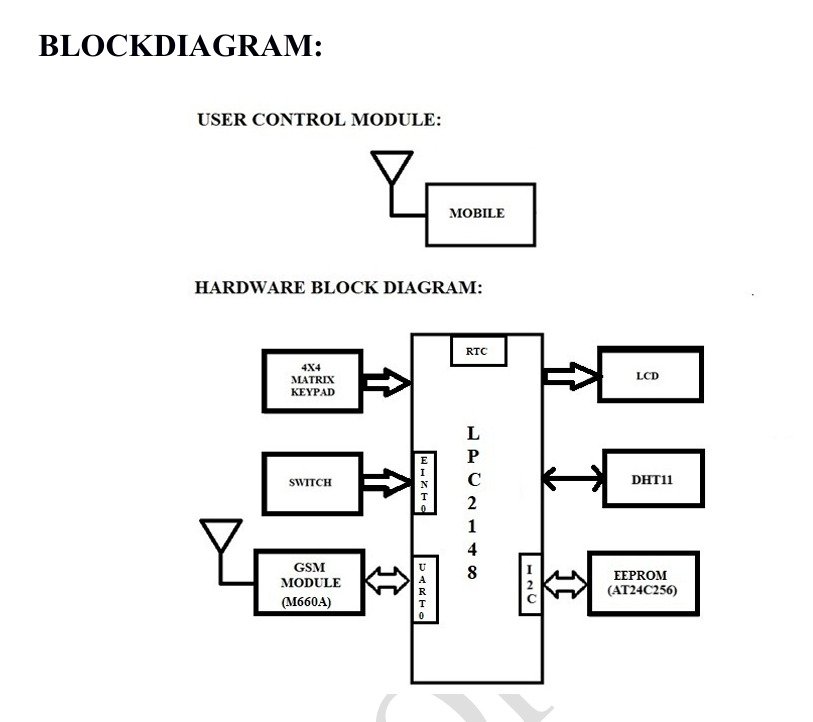
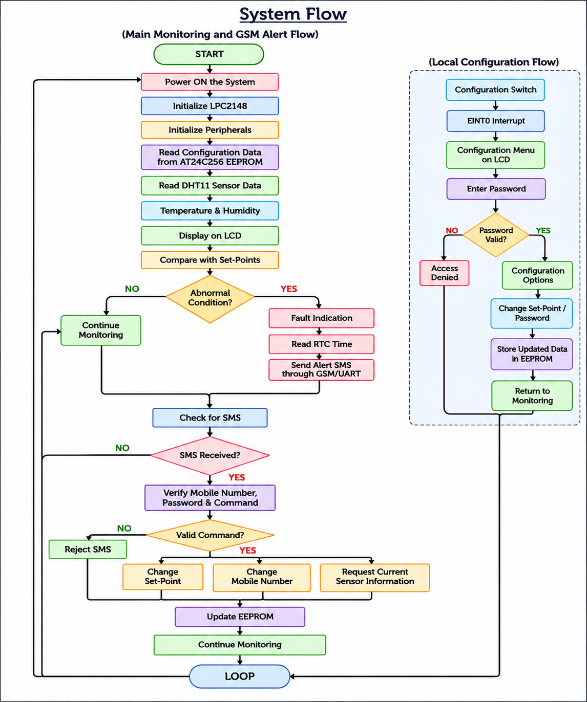
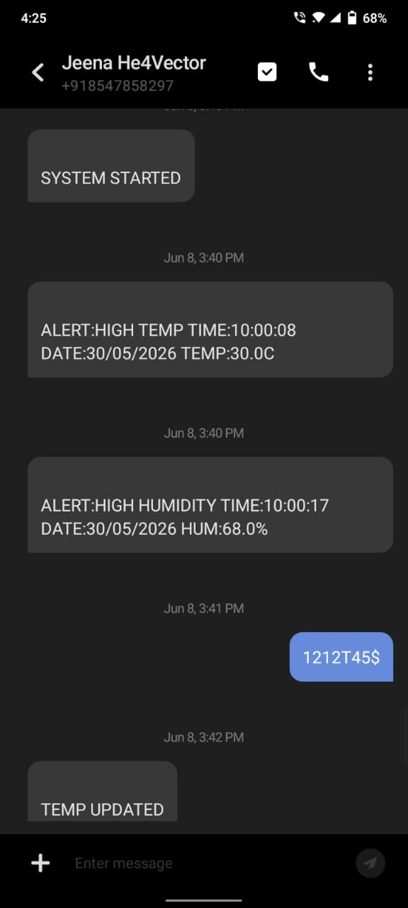

# Secure GSM-Based Thermal Monitoring and Set-Point Control System using LPC2148

## Project Overview

This project implements a Secure GSM-Based Thermal Monitoring and Set-Point Control System using the LPC2148 ARM7 microcontroller. The system continuously monitors temperature and humidity using the DHT11 sensor, compares the values with configurable set points, stores configuration data in EEPROM, and sends GSM SMS alerts with RTC timestamps when abnormal conditions occur. Password-protected SMS commands and keypad-based configuration provide secure local and remote control.

## Objectives

- To continuously monitor temperature and relative humidity using the DHT11 sensor.
- To compare the measured temperature and humidity values with predefined set-points.
- To store set-points and other configuration parameters in the AT24C256 external EEPROM.
- To display real-time temperature and humidity readings on the LCD.
- To provide SMS-based alerts through the GSM module when the measured values exceed the configured limits.
- To provide local configuration of system parameters using the 4×4 matrix keypad.
- To provide secure remote configuration through password-protected SMS commands.
- To use the LPC2148 on-chip RTC to provide date and time information for alert messages.
- To restrict remote configuration to an authorized mobile number.
- To develop the complete monitoring and configuration system using the LPC2148 ARM7 microcontroller.
--- 

## Key Features

- LPC2148 ARM7 microcontroller-based embedded system
- Real-time temperature and relative humidity monitoring using the DHT11 sensor
- 16×2 LCD display for sensor readings and user menus
- Configurable temperature and humidity set-points
- GSM M660A-based SMS alert notification
- Password-protected remote configuration through SMS commands
- Authorized mobile-number-based access for remote configuration
- AT24C256 external EEPROM for non-volatile storage of configuration data
- LPC2148 on-chip RTC for providing timestamps for alert messages
- 4×4 matrix keypad for local user interaction and configuration
- Password change through the local keypad interface
- External interrupt-based local configuration
- LED indication for system status and fault conditions
- UART interrupt-based GSM communication
- Embedded C firmware for complete system control and operation

## Block Diagram

## Hardware Used

- LPC2148 ARM7 Microcontroller
- DHT11 Temperature & Humidity Sensor
- GSM Module
- AT24C256 EEPROM
- 16×2 LCD
- 4×4 Matrix Keypad
- LEDs
- Switch
- DB-9 Cable / USB-UART Converter

## Software Used

- Embedded C
- Keil uVision
- Flash Magic

## Communication Interfaces

### UART

UART is used for serial communication between the LPC2148 and the GSM module.

**LPC2148 ↔ GSM Module**

UART communication is handled using interrupts for GSM data transmission and reception.

### I2C

I2C is used for communication between the LPC2148 and the AT24C256 external EEPROM.

**LPC2148 ↔ AT24C256 EEPROM**

The EEPROM is used for non-volatile storage of system configuration data such as set-points, password, and authorized mobile number.

### DHT11 Single-Wire Communication

The DHT11 uses a single-wire digital communication protocol to transfer temperature and relative humidity data to the LPC2148.

**LPC2148 ↔ DHT11**

### GPIO

GPIO pins are used to interface with peripherals such as the 16×2 LCD, 4×4 matrix keypad, and LEDs.

**LPC2148 ↔ LCD / Keypad / LEDs** 

## System Peripherals

### Real-Time Clock (RTC)

The LPC2148 on-chip Real-Time Clock (RTC) maintains the system date and time.

The RTC is used to provide timestamps in alert SMS messages when abnormal temperature or humidity conditions are detected.

### External Interrupt (EINT0)

The LPC2148 external interrupt EINT0 is triggered by the configuration switch.

It is used to enter the local configuration menu, where the user can change temperature and humidity set-points or the password through the LCD and 4×4 matrix keypad.

## Working Principle

1. When the system is powered ON, the LPC2148 initializes the required peripherals, including the LCD, keypad, UART, I2C interface, RTC, DHT11 interface, and external interrupt.

2. The DHT11 sensor measures the surrounding temperature and relative humidity and transfers the digital sensor data to the LPC2148 using its single-wire communication protocol.

3. The LPC2148 processes the received sensor data and displays the current temperature and relative humidity values on the LCD.

4. The system stores the configured temperature and relative humidity set-points, password, and authorized mobile number in the AT24C256 EEPROM.

5. The LPC2148 reads the configured set-points from the EEPROM and compares them with the current temperature and relative humidity values received from the DHT11.

6. If the measured temperature or relative humidity exceeds its corresponding set-point, the system generates a fault indication using the LED and sends an alert SMS to the authorized mobile number through the GSM module.

7. The LPC2148 on-chip RTC maintains the current date and time, which is used to provide a timestamp in the alert SMS.

8. The system continuously checks for incoming SMS messages through the GSM module.

9. When an SMS is received, the system verifies the sender's mobile number, password, and command format.

10. If the SMS is received from the authorized mobile number and contains a valid command, the requested operation is performed.

11. The supported remote SMS commands include:
    - Changing the temperature set-point.
    - Changing the authorized mobile number.
    - Requesting the current temperature and humidity information.

12. When a valid set-point or mobile-number modification command is received, the updated value is written to the corresponding EEPROM location.

13. When a sensor-information request is received, the LPC2148 reads the current temperature and humidity from the DHT11 and sends the information to the authorized mobile number through the GSM module.

14. If an SMS does not follow the required command format or fails authentication, it is rejected and the system continues monitoring.

15. For local configuration, the user activates the configuration switch connected to the EINT0 external interrupt.

16. The local configuration menu is displayed on the LCD, and the user uses the 4×4 matrix keypad to select the required operation.

17. After successful password verification, the user can modify the temperature set-point, relative humidity set-point, or password.

18. The modified configuration values are stored in the AT24C256 EEPROM so that they are retained after a power restart.

19. The system continues monitoring temperature and relative humidity while handling authorized GSM commands and local configuration requests.

## System Modules

The system is divided into the following functional modules:

- **Temperature and Humidity Monitoring Module** – Reads temperature and relative humidity from the DHT11 sensor and provides the measured values to the LPC2148 for processing.

- **Display Module** – Displays temperature, relative humidity, menus, configuration options, and system status information on the LCD.

- **GSM Communication Module** – Handles SMS transmission and reception through the GSM M660A module using UART0 communication.

- **EEPROM Configuration Module** – Stores and retrieves temperature and humidity set-points, password, and authorized mobile number using the AT24C256 EEPROM through I2C communication.

- **Local Configuration Module** – Provides password-protected local configuration using the EINT0 switch, LCD, and 4×4 matrix keypad.

- **Security and Authentication Module** – Verifies the authorized mobile number, password, and SMS command format before processing remote configuration commands.

- **RTC Module** – Maintains date and time information for timestamping alert SMS messages.

- **Alert and Indication Module** – Provides fault indication and generates SMS alerts when configured temperature or humidity limits are exceeded.
## System Flow

## Results and Outputs

### 1. LCD Output

The LCD displays the real-time temperature and relative humidity values measured by the DHT11 sensor.

### 2. GSM Commands

The GSM module receives and processes authorized SMS commands for remote configuration and sensor information requests.

### 3. GSM Alerts

The system sends SMS alerts to the authorized user when abnormal conditions are detected.

### 4. Temperature and Humidity Alerts

The system generates alerts when the configured temperature or humidity limits are exceeded, with RTC-based date and time information.

### 5. Final Hardware Setup

The final hardware setup demonstrates the LPC2148-based system with the connected sensor, LCD, keypad, GSM module, and other peripherals.

## Applications

The Secure GSM-Based Thermal Monitoring and Set-Point Control System can be used in environments where continuous temperature and humidity monitoring, local configuration, and remote SMS-based alert notification are required.

- **Industrial Equipment Monitoring** – Monitoring temperature and humidity around industrial equipment and machinery.

- **Server and Equipment Rooms** – Monitoring environmental conditions around servers, electrical panels, and other temperature-sensitive electronic equipment.

- **Storage and Warehousing** – Monitoring temperature and humidity in storage areas where environmental conditions can affect stored materials.

- **Laboratories and Controlled Environments** – Monitoring environmental conditions in laboratories and other controlled environments.

- **Production Environments** – Monitoring temperature and humidity conditions in manufacturing and production areas.

- **Greenhouses and Agricultural Environments** – Monitoring temperature and humidity conditions in controlled agricultural environments.

- **Remote Safety Monitoring** – Sending SMS alerts to an authorized user when configured temperature or humidity limits are exceeded.

- **Temperature-Sensitive Equipment Protection** – Providing early notification when environmental conditions exceed the configured limits.

## Advantages

- **Real-Time Monitoring** – Continuously monitors temperature and relative humidity using the DHT11 sensor.

- **Remote Alert Notification** – Sends SMS alerts to the authorized user when the configured temperature or humidity limits are exceeded.

- **Secure Remote Access** – Password-protected SMS commands help prevent unauthorized modification of system settings.

- **Authorized User Verification** – Remote commands are accepted only from the authorized mobile number.

- **Local and Remote Configuration** – Allows configuration of set-points and password through the local keypad and authorized SMS commands.

- **Non-Volatile Data Storage** – Stores important configuration data in the AT24C256 EEPROM, allowing the settings to be retained after power loss.

- **Timestamped Alerts** – Uses the LPC2148 on-chip RTC to provide date and time information for alert messages.

- **Simple User Interface** – Provides a 16×2 LCD and 4×4 matrix keypad for local monitoring and configuration.

- **Independent Operation** – Performs monitoring and alert functions without requiring a computer during operation.

- **Modular Design** – Separates peripheral and functional modules, making the firmware easier to understand, maintain, test, and modify.

- **GSM-Based Remote Communication** – Enables remote monitoring and notification through SMS communication.

- **Low-Cost Embedded Solution** – Uses a microcontroller-based architecture with commonly available embedded peripherals.

## Limitations

- **DHT11 Accuracy and Response Time** – The DHT11 provides suitable temperature and humidity measurements for basic monitoring, but its accuracy and response speed are limited compared with higher-end sensors.
- **GSM Network Dependency** – SMS alerts and remote commands depend on GSM network availability and signal strength. Delays may occur when network connectivity is poor.

  
## Future Enhancements

- **IoT and Cloud Integration** – Integrate IoT connectivity and cloud storage for remote monitoring, data logging, and visualization of temperature and humidity data.

- **Mobile Application** – Develop a mobile application for remote monitoring, configuration, and alert management.

- **Advanced Sensors** – Replace the DHT11 with more accurate and reliable temperature and humidity sensors for improved measurement performance.

- **Data Logging and Analysis** – Add long-term storage of sensor readings and graphical analysis to identify environmental trends.

## Conclusion

The Secure GSM-Based Thermal Monitoring and Set-Point Control System using LPC2148 provides an embedded solution for temperature and humidity monitoring with local and remote configuration capabilities. The system integrates DHT11, LCD, AT24C256 EEPROM, GSM, keypad, RTC, and external interrupt functionalities to provide sensor monitoring, configurable set-points, secure SMS-based access, and alert notification. The project demonstrates practical implementation of Embedded C, peripheral interfacing, UART and I2C communication, sensor interfacing, EEPROM data storage, RTC, and GSM-based remote monitoring.

## Author

**Jeena Susan Kurian**
